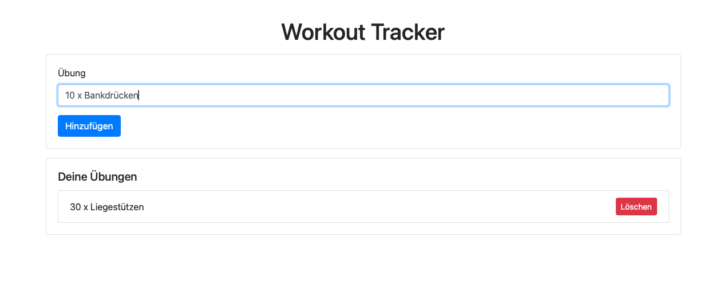
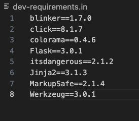
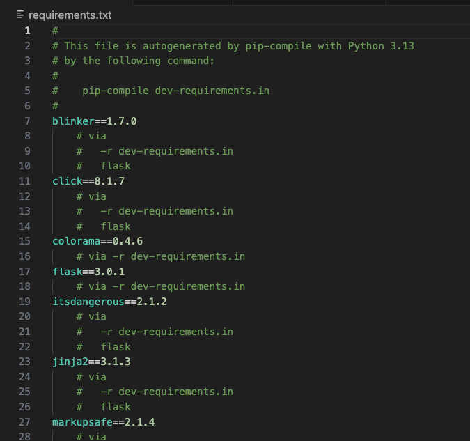
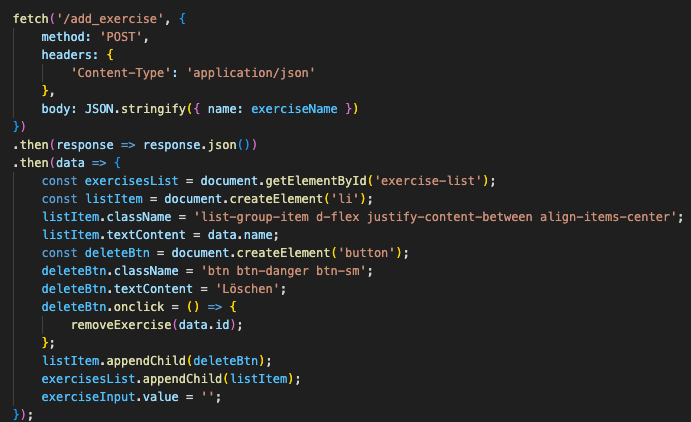

# Lernjournal 1 Python

## Repository und Library

| | Bitte ausfüllen |
| -------- | ------- |
| Repository | https://github.com/mauricerueegg/lernjournal1-python-projekt  |
| Kurze Beschreibung der App-Funktion | Workout Tracker |
| Verwendete Library aus PyPi (Name) | Verwendete Library aus PyPi (URL) |
|------------------------------------|-----------------------------------|
| blinker                            | https://pypi.org/project/blinker/ |
| click                              | https://pypi.org/project/click/   |
| colorama                           | https://pypi.org/project/colorama/|
| Flask                              | https://pypi.org/project/Flask/   |
| itsdangerous                       | https://pypi.org/project/itsdangerous/ |
| Jinja2                             | https://pypi.org/project/Jinja2/  |
| MarkupSafe                         | https://pypi.org/project/MarkupSafe/ |
| Werkzeug                           | https://pypi.org/project/Werkzeug/|

## App, Funktionalität

Die entwickelte App „Workout Tracker“ ermöglicht es Benutzer:innen, ihre Trainingsübungen einfach zu verwalten. Über ein Eingabefeld können sie Übungen wie z. B. „30 x Liegestützen“ hinzufügen. Diese werden in einer Liste angezeigt, inklusive eines „Löschen“-Buttons, um einzelne Einträge zu entfernen. Die Daten werden per JavaScript an ein Flask-Backend gesendet, das die Übung empfängt und in einer Liste speichert. Die Webanwendung basiert auf HTML, JavaScript und Python (Flask) und nutzt localStorage zur Zwischenspeicherung sowie dynamisches DOM-Rendering für Benutzerinteraktionen.



## Dependency Management

Das Projekt verwendet pip-tools, um die Abhängigkeiten sauber zu verwalten. Im Entwicklungsprozess werden die Libraries in der Datei dev-requirements.in aufgelistet. Mit dem Befehl pip-compile wird daraus automatisiert eine requirements.txt generiert. Das sorgt dafür, dass alle transitive Abhängigkeiten mit den exakten Versionen eingefroren werden, was eine reproduzierbare Entwicklungsumgebung sicherstellt.




## Deployment

Die Anwendung ist lokal ausführbar. Dazu sind folgende Schritte nötig:

```bash
python -m venv .venv
source .venv/bin/activate
```

```bash
pip install -r requirements.txt
```

Die Benutzeroberfläche der App wurde mit einfachem HTML und JavaScript umgesetzt. Das HTML-Formular ermöglicht die Eingabe von Übungen, während JavaScript die Logik zur Verarbeitung übernimmt.

In der ersten Code-Szene (Screenshot 1) wird die Funktion addExercise() gezeigt. Diese fügt eine neue Übung zur exercises-Liste hinzu und speichert sie direkt im localStorage des Browsers. Dadurch bleiben die Daten auch nach einem Neuladen der Seite erhalten.


Die zweite Code-Szene zeigt den Fetch-Request, mit dem das HTML-Formular beim Absenden eine POST-Anfrage an das Flask-Backend sendet. Die Antwort des Servers enthält die gespeicherte Übung, welche dann über DOM-Manipulation in die Liste eingefügt wird. Gleichzeitig wird ein „Löschen“-Button mit Event-Handler generiert, um die jeweilige Übung bei Bedarf wieder zu entfernen.


 


```bash
flask --app app run
```
Anschliessend ist die App unter http://127.0.0.1:5000/ erreichbar. 


