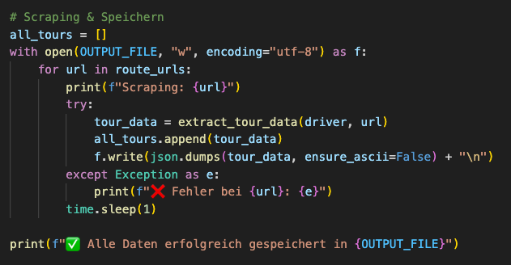
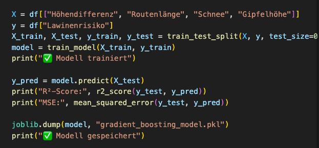
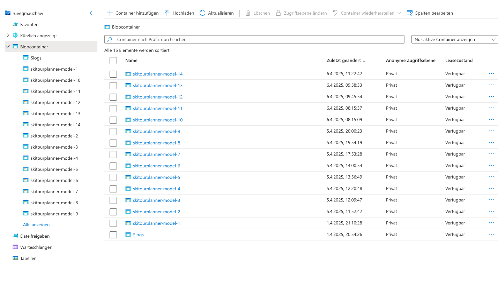
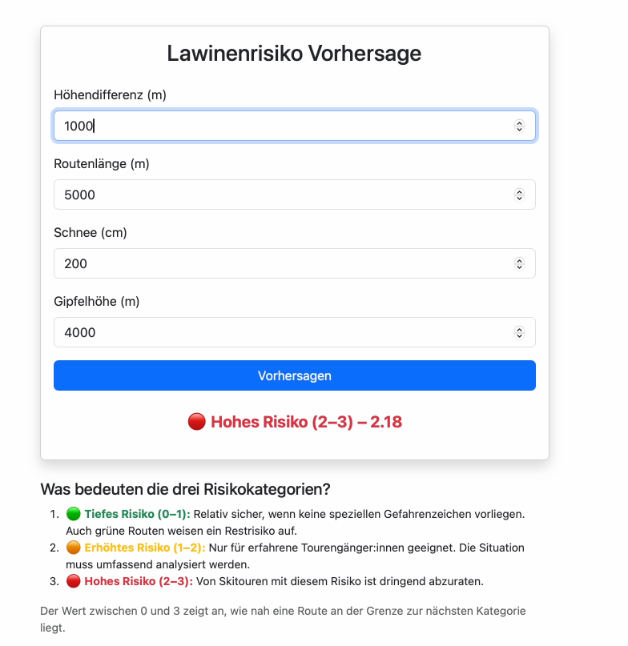

# Projekt 1 Python

## Übersicht

| | Bitte ausfüllen |
| -------- | ------- |
| Variante | Eigenes Projekt |
| Datenherkunft | Scraping HTML, Speicherung JL |
| Datenherkunft | https://www.skitourenguru.ch/area-view?area=ch |
| ML-Algorithmus | Gradient Boosting |
| Repo URL | https://github.com/mauricerueegg/SkiTourPlanner |

## Dokumentation

### Data Scraping

Die Daten werden von https://www.skitourenguru.ch/area-view?area=ch gescraped und danach ein Modell trainiert.

#### 1. `scraper.py` – Einstiegspunkt

Dieses Skript steuert den gesamten Ablauf:
- Definiert die Anzahl und ID-Range der zu scrapenden Touren
- Nutzt `generate_route_urls()` aus `utils.py`, um eine Liste von Tour-URLs zu generieren
- Initialisiert den Webdriver
- Ruft für jede Tour `extract_tour_data()` auf
- Speichert die Ergebnisse in `downloads/skitouren_daten.jl`



#### 2. `utils.py` – Hilfsfunktionen
Dieses Modul enthält zwei wichtige Komponenten:
- `generate_route_urls(num_ids, id_range)`: Erzeugt eine Liste zufälliger, möglicherweise gültiger Tour-URLs basierend auf einem ID-Bereich
- `setup_driver()`: Initialisiert einen Selenium Chrome WebDriver (headless), der für das Scraping benötigt wird

Selenium wird verwendet, um die Websiten dynamisch zu laden und Inhalte auszulesen, die mit einem normalen requests-Aufruf nicht verfügbar gewesen wären.

---

#### 3. `extractor.py` – Datenextraktion
Enthält die Logik zum Parsen und Strukturieren der Daten einer einzelnen Skitour:
- Verwendet `BeautifulSoup` zur Analyse der HTML-Struktur
- Gibt ein sauberes Python-Dictionary zurück

Es werden folgende Daten gescraped:
- Gipfel
- Start
- Höhendifferenz
- Routenlänge
- Aufstiegszeit
- Schwierigkeitsgrad
- Schnee
- Lawinenrisiko (Target)


**Beispielausgabe:**
```json
{
  "url": "https://www.skitourenguru.ch/track-view?area=ch&id=345",
  "Gipfel": "Piz Dora",
  "Gipfelhöhe_m": 2949,
  "Startort": "Tschierv",
  "Starthöhe_m": 1660,
  "Höhendifferenz_hm": 1288,
  "Routenlänge_m": 4764,
  "Aufstiegszeit_h": 4.0,
  "Schwierigkeitsgrad": "WS+ (manuell)",
  "Schneehöhe_cm": {
    "Minimum": 41,
    "Maximum": 109,
    "Durchschnitt": 84,
    "Schneebedeckung_prozent": 100
  },
  "Lawinenrisiko": 0.55
}
```

#### 4. `downloads/` – Speicherort der gescrapten Daten
Alle Ergebnisse des Scraping-Prozesses werden als `.jl`-Datei (JSON Lines) gespeichert:
- Pfad: `downloads/skitouren_daten.jl`
- Jede Zeile ist ein JSON-Objekt


#### 5. `mongo_import.py` – Upload nach MongoDB
Dieses Skript liest die `.jl`-Datei aus dem `downloads`-Ordner und importiert die Tour-Daten in eine MongoDB:
- Verwendet `pymongo`
- Kann mit einem lokalen oder Cloud-basierten MongoDB-Cluster verbunden werden
- Vermeidet Duplikate durch Prüfung auf vorhandene URLs

projekt1-python/images/extractor.png

- Ich hatte dan Probleme, da ich mich über Azure nicht mit Mongo verbinden konnte. Wenn ich über Azure das Terminal öffnete, funktioniert es nicht. Deshalb habe ich die MongoDB-Shell auch ins VSCode importiert und von dort aus geprüft ob die Daten korrekt in MongoDB geladen wurden.

```bash
mongosh "<MONGO_URI>"
use skitouren
db.skitouren_collection.find().pretty()
```

### Training

#### 1. `model.py` – Modelltraining
Dieses Skript ist verantwortlich für das Training eines Machine-Learning-Modells, das das Lawinenrisiko vorhersagt:

- Lädt die Tour-Daten direkt aus einer MongoDB-Datenbank


- Führt eine Vorverarbeitung der Features durch (Numerische Umrechnung von Höhendifferenz, Routenlänge etc.)
- Beim Model Training habe ich festgestellt das ich mit den Features Höhendifferenz, Routenlänge, Schnee und Gipfelhöhe die höchste Korrelation mit dem Lawinenrisiko erhalten. Daher habe ich nur diese Features für das Modell verwendet.
- Verwendet das `GradientBoostingRegressor`-Modell aus `sklearn`

Quelle:
https://scikit-learn.org/stable/modules/generated/sklearn.ensemble.GradientBoostingRegressor.html

- Bewertet die Modellgüte anhand verschiedener Metriken wie MSE und R²
- Gibt ein trainiertes Modellobjekt zurück




#### 2. `save.py` – Modellversionierung & Upload
Dieses Skript speichert das trainierte Modell als `.pkl`-Datei und lädt es versioniert in einen Azure Blob Storage:

- Das Modell wird mit `joblib` serialisiert
- Der Dateiname enthält einen Zeitstempel zur Versionierung (z. B. `gradient_boosting_model_12'.pkl`)
- Die Verbindung zu Azure Blob erfolgt über `azure-storage-blob`
- Ermöglicht CI/CD-fähiges Modellmanagement




#### 3. `gradient_boosting_model.pkl` – Aktuelle Modellversion
Dies ist die zuletzt trainierte und gespeicherte Modellversion:

- Format: Pickle-Datei (`.pkl`)
- Inhalt: Serialisiertes Scikit-Learn Regressionsmodell
- Eingesetzt im Flask-Backend zur Vorhersage des Lawinenrisikos

### ModelOps Automation

#### 🎯 Zweck:
- Vollständig automatisierte Modellpipeline
- Manuell ausführbar über die GitHub Actions Oberfläche (`workflow_dispatch`)
- Integration mit MongoDB und Azure Blob Storage

#### ⚙️ Ablauf der Schritte


##### 1. **Repository auschecken**
```yaml
- name: Checkout repository
  uses: actions/checkout@v3
```
🔹 Holt den Code aus dem Repository, um mit ihm zu arbeiten.

#### 2. **Python einrichten**
```yaml
- name: Set up Python
  uses: actions/setup-python@v4
  with:
    python-version: '3.13.2' 
    cache: 'pip'
```
🔹 Installiert Python (Version 3.13.2) und aktiviert pip-Cache für schnellere Builds.

#### 3. **Abhängigkeiten installieren**
```yaml
- name: Install dependencies
  run: pip install -r requirements.txt
```
🔹 Installiert alle Python-Pakete, die in `requirements.txt` definiert sind.

#### 4. **Daten scrapen**
```yaml
- name: Run scraper
  working-directory: ./scraper
  run: python scraper.py
```
🔹 Führt den Web-Scraper aus, um aktuelle Skitourendaten zu erfassen.

#### 5. **Daten in MongoDB hochladen**
```yaml
- name: Upload data to MongoDB
  working-directory: ./scraper
  run: python mongo_import.py -c skitour -i ./downloads/skitouren_daten.jl -u "${{ secrets.MONGODB_URI }}"
```
🔹 Importiert die gescrapten Daten in die MongoDB-Datenbank.
🔒 Verwendet das Secret `MONGODB_URI` für die sichere Verbindung.


#### 6. **Modell trainieren**
```yaml
- name: Train model
  working-directory: ./model
  run: python model.py -u "${{ secrets.MONGODB_URI }}"
```
🔹 Trainiert ein Machine-Learning-Modell auf Basis der MongoDB-Daten.


#### 7. **Modell speichern (Azure Blob)**
```yaml
- name: Save model to Azure Blob
  working-directory: ./model
  run: python save.py -c "${{ secrets.AZURE_STORAGE_CONNECTION_STRING }}"
```
🔹 Serialisiert und speichert das Modell in einem Azure Blob Container.
🔒 Verwendet das Secret `AZURE_STORAGE_CONNECTION_STRING`.

#### 🔐 Verwendete GitHub Secrets

| Secret                        | Beschreibung                              |
|------------------------------|-------------------------------------------|
| `MONGODB_URI`                | Verbindung zur MongoDB-Datenbank          |
| `AZURE_STORAGE_CONNECTION_STRING` | Zugriff auf Azure Blob Storage        |


#### ✅ Vorteile dieser Automatisierung

- Keine manuelle Ausführung nötig
- Reproduzierbare Ergebnisse
- Kombinierbar mit Deployments (`workflow_run`)
- Modular und erweiterbar
* 

### Deployment


#### 🎯 Zweck:
- Baut ein Docker-Image aus dem Repository
- Pusht das Image in die GitHub Container Registry (GHCR)
- Deployt das Image automatisch auf eine Azure Web App
- Wird **manuell** gestartet oder automatisch nach erfolgreichem Modelltraining (`model.yml`)


#### ⚙️ Ablauf der Schritte

#### 🛠 Build Job

#### 1. **Repository auschecken**
```yaml
- name: Checkout repository
  uses: actions/checkout@v3
```

#### 2. **Docker Buildx Setup**
```yaml
- name: Set up Docker Buildx
  uses: docker/setup-buildx-action@v1
```
🔹 Aktiviert erweitertes Docker-Build-System (z. B. für Multi-Architektur).

#### 3. **Login bei GHCR**
```yaml
- name: Log in to GitHub container registry
  uses: docker/login-action@v1.10.0
```
🔹 Authentifiziert sich mit `GITHUB_TOKEN` beim Container-Registry `ghcr.io`.

#### 4. **Repo-Name kleinschreiben**
```yaml
- name: Lowercase the repo name and username
  run: echo "REPO=${GITHUB_REPOSITORY,,}" >>${GITHUB_ENV}
```

#### 5. **Docker-Image bauen & pushen**
```yaml
- name: Build and push container image to GHCR
  uses: docker/build-push-action@v2
```
🔹 Erstellt ein Docker-Image und veröffentlicht es unter:

```
ghcr.io/<user>/<repo>:<commit-sha>
```

#### 🚀 Deploy Job

#### 6. **Azure Deployment**
```yaml
- name: Deploy to Azure Web App
  uses: azure/webapps-deploy@v2
```
🔹 Deployt das zuvor gebaute Image direkt auf die Azure Web App.

#### 🔐 Verwendete GitHub Secrets

| Secret                         | Beschreibung                                      |
|--------------------------------|---------------------------------------------------|
| `GITHUB_TOKEN`                | Authentifizierung für GHCR                        |
| `AZURE_WEBAPP_NAME`           | Name der WebApp, auf die deployed wird           |
| `AZURE_WEBAPP_PUBLISH_PROFILE`| Zugriffstoken für die Azure Web App Deployment   |


#### ✅ Vorteile dieser Automatisierung

- CI/CD-Workflow nach Best Practices
- Keine manuelle Interaktion mehr notwendig
- Automatischer Trigger durch Modelltraining (`model.yml`)
- Reproduzierbare und versionierte Container mit Tagging


### Frontend

